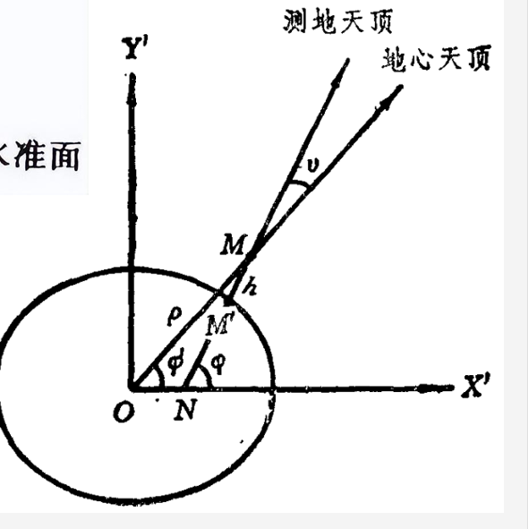

# 第三次作业

## 差异原因：
在20-22行的代码中，采用的是测地经纬度，从图中可以看到，这样并没有过地心，但是后续都使用了地心参考系进行转换，这样会对结果造成一定的误差。

此时输出的结果为:\
185.66384149956983 30.66576858956426 \
185.67383365296857 30.838414945709186 \
如果采用地心纬度，在25-28行中，就不存在这样的差异，此时的输出结果为： \
185.48803544366146 29.88373659864913 \
185.48786581435758 29.884302466115706